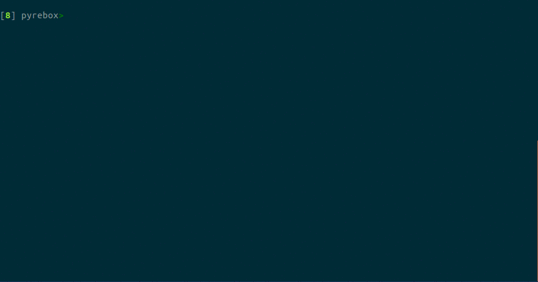
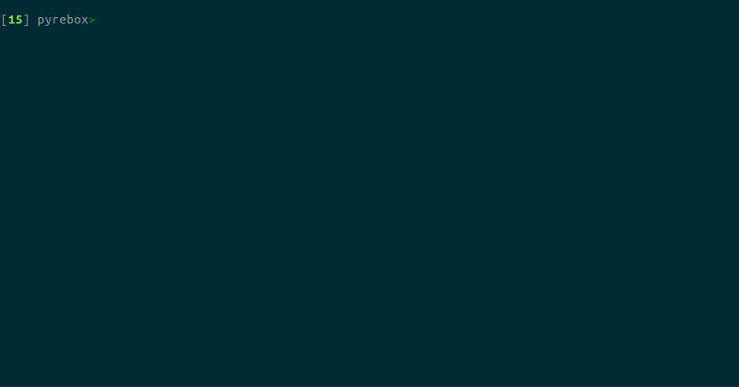

.. _QEMU: http://qemu.org/
.. _DECAF: https://github.com/sycurelab/DECAF 
.. _S2E: https://github.com/dslab-epfl/s2e
.. _AVATAR: https://github.com/avatartwo 
.. _PANDA: https://github.com/panda-re/panda
.. _Volatility: http://www.volatilityfoundation.org/ 
.. _BUILD: BUILD.rst 
.. _here: https://github.com/Cisco-Talos/pyrebox/issues
.. _slides: https://github.com/Cisco-Talos/pyrebox/tree/master/docs/pyrebox_hitb_ams.pdf
.. _available: https://github.com/Cisco-Talos/pyrebox/tree/master/docs/pyrebox_euskalhack.pdf
.. _scripts: https://github.com/Cisco-Talos/pyrebox/tree/master/scripts
.. _readthedocs.io: https://pyrebox.readthedocs.io/en/latest/
.. _questions: https://github.com/Cisco-Talos/pyrebox/issues?utf8=%E2%9C%93&q=is%3Aissue%20label%3Aquestion%20
.. _presentation: https://www.youtube.com/watch?v=F2voG87obzM
.. _Contest: https://volatility-labs.blogspot.com/2017/11/results-from-5th-annual-2017-volatility.html 

PyREBox is a Python scriptable Reverse Engineering sandbox. It is based on QEMU, and its goal is 
to aid reverse engineering by providing dynamic analysis and debugging capabilities from a 
different perspective. PyREBox allows to inspect a running QEMU VM, modify its memory or 
registers, and to instrument its execution, by creating simple scripts in python to automate 
any kind of analysis. QEMU (when working as a whole-system-emulator) emulates a complete 
system (CPU, memory, devices...). By using VMI techniques, it does not require to perform any 
modification into the guest operating system, as it transparently retrieves information from 
its memory at run-time.

Several academic projects such as DECAF_, PANDA_, S2E_, or AVATAR_, have previously leveraged QEMU 
based instrumentation to overcome reverse engineering tasks. These projects allow to write plugins 
in C/C++, and implement several advanced features such as dynamic taint analysis, symbolic execution, 
or even record and replay of execution traces. With PyREBox, we aim to apply this technology focusing 
on keeping the design simple, and on the usability of the system for threat analysts.

PyREBox won the Volatility Plugin Contest_ in 2017!

This tool was presented at HITB Amsterdam 2018. You can see the slides_, or watch the presentation_. It
was also presented at the third edition of EuskalHack Security Congress (slides available_).

What's new
==========

Remember to pull the latest version of PyREBox in order to enjoy its latest features. PyREBox is under
active development and new cool features are yet to come! The master branch should always contain an stable
version, while the dev branches contain the latest, work-in progress features. The following announcement
list refers to the master branch, and the date when the development changes were merged into master.

- [Dec 5,  2019] **Beta version of PyREBox3, ready on the python3migration branch**. The tool has been ported to Python3 and Volatility3. Plugins have not been ported yet.
- [Jun 21, 2019] **Upgraded QEMU to version 4.0.0, with MTTCG (multi-threaded TCG) support.** Special thanks to @richsurgenor for his valuable contributions to this upgrade.
- [Jun 17, 2019] Merge of dev branch (Malware monitor 2).
- [Jun 17, 2019] Mouse movement automation.
- [Jun 17, 2019] Upgraded volatility.
- [Oct 17, 2018] Added API function to get system time from windows guests.
- [Oct 17, 2018] Added support for symbols in BP (breakpoint) class.
- [Oct 17, 2018] Added symbol cache (host file). See example configuration files (pyrebox.conf.WinXPSP3x86).
- [Oct 17, 2018] Changed symbol fetching to obtain DLL files from disk.
- [Oct 10, 2018] Added experimental support to fetch non-mapped memory pages.
- [0ct 10, 2018] Added The Sleuth Kit integration
- [Aug 02, 2018] Added autorun scripts.
- [Jul 26, 2018] Uploaded slides of EuskalHack 2018 presentation.
- [Jul 02, 2018] Fixes to provide CentOS 7 support. 
- [Jun 25, 2018] Added scripts presented at EuskalHack 2018.
- [May 31, 2018] Upgraded to Qemu v2.12.0.
- [May 29, 2018] Added the possibility to call trigger functions (in C/C++) from python scripts.
- [May 29, 2018] **Changed the callback parameter format.** See documentation. Default is still the old-style.
- [Apr 28, 2018] Created a development branch for new and potentially unstable features in PyREBox.
- [Apr 13, 2018] Presented PyREBox at HITB Amsterdam (CommSec track).
- [Apr 13, 2018] Added malware monitoring scripts (mw_mon).
- [Mar 08, 2018] **Triggers are now called for every process in the system (not only monitored processes). See documentation**
- [Mar 08, 2018] **Changed memory read/write callback parameters. See documentation and examples.** 
- [Mar 08, 2018] Added physical memory address read/write breakpoints.
- [Mar 08, 2018] Added module load and remove callbacks.
- [Nov 02, 2017] Added guest agent for linux 32 and 64 bits.
- [Oct 23, 2017] Added guest agent for Windows 32 and 64 bits.
- [Oct 11, 2017] Added linux module symbol parsing.
- [Sep 22, 2017] Added support for module reloading.
- [Sep 20, 2017] Added custom function callback to BP class.
- [Sep 20, 2017] Upgraded to Qemu v2.10.0.
- [Aug 31, 2017] Partial support for linux guests.

Install
=======

A build script is provided. For specific details about dependencies, please see BUILD_. We also provide a Dockerfile.

Documentation
=============

The documentation of this project is hosted at readthedocs.io_.

Bugs, questions and support
===========================

If you think you've found a bug, please report it here_.

Before creating a new issue, please go through the questions_ opened by other users before.

This program is provided "AS IS", and no support is guaranteed. That said, in order to help
us solve your issues, please include as much information as possible in order to reproduce the bug:

- Operating system used to compile and run PyREBox.
- The specific operating system version and emulation target you are using.
- Shell command / script / task you were trying to run.
- Any information about the error such as error messages, Python (or IPython) stack trace, or QEMU stack trace.
- Any other relevant information

Roadmap
=======

- VM image configuration and management console.
- Support for ARM, MIPS, and other architectures.
- Finish support for GNU/Linux guest systems (see issues).

Starting a VM
=============

PyREBox is based on QEMU, so in order to start a VM withing PyREBox, you need to run it exactly as you
were booting up a QEMU VM. A couple of example scripts are provided: ``start_i386.sh``, ``start_x86_64.sh``,
you can use them as an example.

The only QEMU monitor option supported currently is *stdio* (``-monitor stdio``).

Goals of this project
=====================

- Provide a whole system emulation platform with a simple interface for inspecting the emulated guest system.

  * Fine grained instrumentation of system events.
  * Integrated Virtual Machine Introspection (VMI), based on volatility. No agent or driver needs to be installed into the guest.
  * An IPython based shell interface.
  * A Python based scripting engine, that allows to integrate into the scripts any of the security tools based on this language (one of the biggest ecosystems).
- Have a clean design, de-coupled from QEMU. Many projects that are built over QEMU do not evolve when QEMU gets upgraded, missing new features and optimizations, as well as security updates. In order to achieve this, PyREBox is implemented as an independent module that can be compiled together with QEMU requiring a minimal set of modifications. 
- Support for different architectures. Currently, PyREBox only supports Windows for x86 and x86-64 bit architectures, but its design allows to support other architectures such as ARM, MIPS, or PowerPC, and other operating systems as well.

IPython shell
=============

Starting a PyREBox shell is as easy as typing the ``sh`` command on QEMU’s monitor. It will immediately start an IPython
shell. This shell records the command history as well as the defined variables. For instance, you can save a
value and recover it later at a different point of the execution, when you start the shell again. PyREBox takes
advantage of all the available features in IPython such as auto-completion, command history, multi-line editing, and
automated command help generation.

PyREBox will allow you to debug the system (or a process) in a fairly stealthy way. Unlike traditional debuggers which stay
in the system being debugged (even modifying the memory of the debugged process to insert breakpoints), PyREBox stays
completely outside the inspected system, and it does not require the installation of any driver or component into
the guest.

PyREBox offers a complete set of commands to inspect and modify the state of the running VM. Just type ``list_commands``
to obtain a complete list. You can run any volatility plugin just by typing ``vol`` and the corresponding volatility command.
For a complete list of available volatility plugins, you
can type ``list_vol_commands``. This list is generated automatically, so it will also show any volatility plugin you
install on PyREBox's ``volatility/`` path. 

You can also define your own commands! It is as simple as declaring a function in a script, and loading it.

If you need something more expressive than a command, you can write a Python snippet leveraging the API. For a detailed
description of the API, see `Documentation`_ or type ``help(api)`` in the shell.

Scripting
=========

PyREBox allows to dynamically load scripts that can register callback functions that are called when certain events
occur, like instructions executed, memory read/written, processes created/destroyed, and so on. 

Given that PyREBox is integrated with Volatility, it will let you take advantage of all the volatility plugins for
memory forensics in your python scripts. Many of the most famous reverse engineering tools are implemented in Python or
at least have Python bindings. Our approach allows to integrate any of these tools into a script.

Finally, given that python callbacks can introduce a performance penalty on frequent events such as
instructions executed, it is also possible to create *triggers*. *Triggers* are native-code plug-in’s (developed in C/C++)
that can be inserted dynamically at run-time on any event just before the Python callback is executed. This allows to
limit the number of events that hit the python code, as well as to precompute values in native code.

In this repository you will find example scripts_ that can help you to write your owncode . Contributions are welcome!

Acknowledgement
===============

First of all, PyREBox would not be possible without QEMU_ and Volatility_. We thank to their developers and
maintainers for such a great work.

PyREBox is inspired by several academic projects, such as DECAF_, or PANDA_. In fact, many of the callbacks
supported by PyREBox are equivalent to those found in DECAF_, and the concepts behind the instrumentation
are based on these works. 

PyREBox benefits from third-party code, which can be found under the directory pyrebox/third_party. 
For each third-party project, we include an indication of its original license, the original source
code files taken from the project, as well as the modified versions of the source code files (if applicable),
used by PyREBox.
