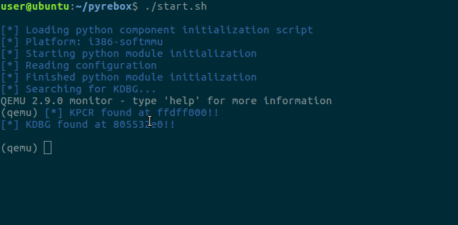
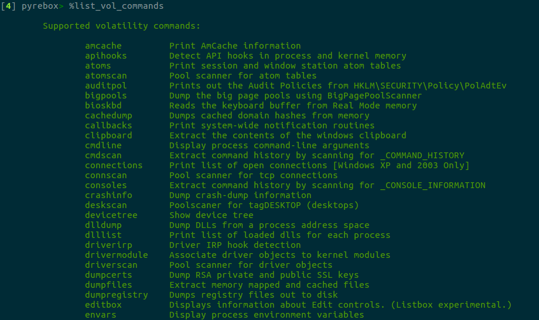
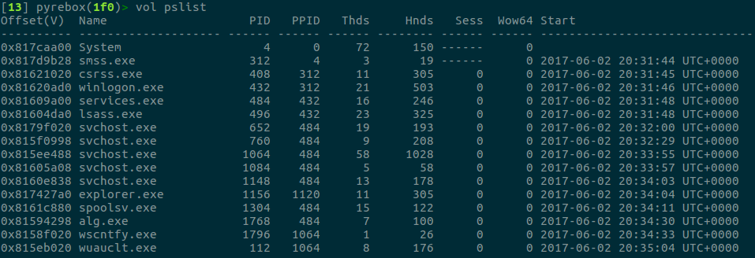
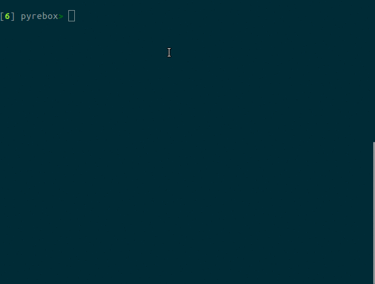

.. _interactive:

PyREBox Shell
=============

NOTE: At this moment the only supported option for monitor is ``-monitor stdio``.

Shell environment basics
------------------------

PyREBox offers a command line that allows to inspect and manipulate the VM at runtime, in different ways. We can distinguish 2 different shell environments: QEMU and PyREBox.

- When PyREBox (QEMU) is started, we will see the QEMU prompt. This shell allows to execute any QEMU command.

- If we type the ``sh`` command, the machine will be paused and we will enter into the PyREBox shell. This mode allows to run any PyREBox command in an IPython shell environment. PyREBox also exposes its complete API so that you can use it programmatically in this shell using python.

Here, we can obtain a full list of commands by typing the following commands:
::
  %list_commands
  %list_vol_commands

The first command will provide us a list of PyREBox commands, as well as all the custom commands defined in dynamically
loaded scripts. The second command will list all the available volatility commands. All the commands can be optionally
preceded by the ``%`` character. 

Scripts can define new **custom** commands. **For running custom commands**, we will need to type ``%custom`` followed by the command name and the parameters for the command. 

Additionally, PyREBox exposes the volatility framework both to the PyREBox shell and the scripting engine. **For running a volatility command**, we will need to type ``%vol`` followed by the volatility command name and its parameters. The list of volatility plugins is generated automatically, so any plugin added to the corresponding volatility directory located in our PyREBox directory will available be for us.

**In order to exit** the PyREBox shell, we can type ``quit``, ``q``, ``c``, or ``continue``, or just ctrl-d.

Some IPython features
---------------------

- **Tab completion**. You can use tab completion in order to inspect the objects and commands during your VM inspection sessions.

- **The ``cpu`` object**. When the *sh* command starts a new PyREBox shell, the state of the CPU is exposed as an object named cpu, which will allow you to retrieve the status for every register in the CPU.

- **Python code in PyREBox commands**. You can embedd python code when running a PyREBox command by using the IPython variable expansion features, such as $ and {}. Example: ``bpr {hex(cpu.ESP - 0x10)}:0x20``. The previous command will place a memory read breakpoint in the memory sorrounding the current stack pointer (ESP). The expression  between {} symbols will be interpreted as python code.

- **Listing available objects**. Apart from the ``cpu`` object, whenever you create a variable in the IPython interpreter, it will be kept for the following session. You can list the available variables by typing the command ``%who``.

- **Obtaining help for a command or API function**. The PyREBox shell will also allow you to obtain information about the different available commands, as well as the API which is exposed to both the PyREBox shell and the scriting engine. You just need to type help(*command*|*api_funcion*), or *command*? | *api_function*? in order to obtain the object's documentation.

QEMU monitor commands 
---------------------

PyREBox adds four commands on top of QEMU:

================= ==================================================================================
**Commmand**      **Description**
----------------- ---------------------------------------------------------------------------------- 
``sh``            Start PyREBox shell 
``import_module`` Load a PyREBox script (module)
``list_modules``  List loaded PyREBox scripts (modules)
``unload_module`` Unload a PyREBox script (module)
``reload_module`` Reload a PyREBox script (module)
================= ==================================================================================

PyREBox shell commands
----------------------

Once you enter the PyREBox shell, you can run any PyREBox command. You can use the ``help()`` python 
function or the ``?`` suffix to obtain a description of the command and its parameters. Many of the 
commands follow the same naming as Windbg commands, but not necessarily the same syntax.

Conventions:

- In order to use a virtual address, just use the hex address: ``0x7c871235``. You can specify physical addresses in the following way: ``p0x00100000``
- The commands that involve referencing virtual addresses require to work on a process context. Use the ``proc`` command to set the process context to one specific running process. You can specify either the process name (or part if it), its PGD, or its PID.

Shell operation commands:

===================== ==================================================================================
**Commmand**          **Description**
--------------------- ---------------------------------------------------------------------------------- 
``list_commands``     List the PyREBox commands available.
``list_vol_commands`` List the Volatility commands available.
``vol comm``          Enter a Volatility command.
``custom comm``       Enter a custom command
``proc``              Specify working context to a given process. You can specify its PID, CR3, or (part of) the name.  Subsequent virtual address will refer to that process.
``mon``               Monitor a process. Many events are triggered only for monitored processes.
``unmon``             Stop monitoring a process.
``set_cpu``           Set the CPU number to operate on (when QEMU is configured to have several CPUs).
``q``                 Exit PyREBox shell and continue execution.
``c``                 Exit PyREBox shell and continue execution.
``continue``          Exit PyREBox shell and continue execution.
``quit``              Exit PyREBox shell and continue execution.
``ctrl-d``            Exit PyREBox shell and continue execution.
``help(*api*)``       Obtain help for an API function or constant.
``help(*comm*)``      Obtain help for a PyREBox command.
``*api*?``            Obtain help for an API function.
``*comm*?``           Obtain help for a PyREBox command.
===================== ==================================================================================

Breakpoints. A PyREBox shell is started when a breakpoint is hit.

============= ==================================================================================
**Commmand**  **Description**
------------- ---------------------------------------------------------------------------------- 
``bd``        Disable breakpoint
``bl``        List breakpoints
``be``        Enable existing breakpoint
``bp``        Set a breakpoint at an address. It accepts virtual and physical addresses, as well as API names. It also accepts memory ranges (e.g., break whenever an instruction in some memory range is executed)
``bpr``       Set a breakpoint at a memory read. Similar to bp, but triggers when the address/range is read.
``bpw``       Set a breakpoint at a memory write. Similar to bp, but triggers when the address/range is written.
============= ==================================================================================

Introspection

============= ==================================================================================
**Commmand**  **Description**
------------- ---------------------------------------------------------------------------------- 
``ps``        List running processes.
``lm``        List modules for a process. Specify process by pid, name, or cr3. Specify '0', 'System' or 'kernel' in order to list kernel modules
============= ==================================================================================

Machine state inspection and manipulation

=============== ==================================================================================
**Commmand**    **Description**
--------------- ---------------------------------------------------------------------------------- 
``print_cpu``   Show cpu.
``dis``         Dissassemble at PC on currently running process.
``u``           Disassemble at a given address.
``db,dw,dd,dq`` Display byte,word,dword,qword of data in memory.
``dump``        Display any size of data in memory.
``eb,ew,ed,eq`` Overwrite byte,word,dword,qword of data in memory. Accepts HEX, ANSI strings and unicode strings.
``write``       Overwrite any size of data in memory. Accepts HEX, ANSI strings and unicode strings. 
``r``           Display and/or manipulate a register. See help.
``ior[b|w|d]``  Read IO port address (byte, word, dword).
``iow[b|w|d]``  Write IO port address (byte, word, dword).
=============== ==================================================================================

Symbols

============= ==================================================================================
**Commmand**  **Description**
------------- ---------------------------------------------------------------------------------- 
``ln``        List nearest symbols (APIs) to a given address.
``x``         List address of a symbol (API). You can use substrings and wildcards. Format is *modulename!api*, you can specify one of them or both.
============= ==================================================================================

Other commands

============= ==================================================================================
**Commmand**  **Description**
------------- ---------------------------------------------------------------------------------- 
``strings``   Display strings in a given memory region.
``s``         Search pattern (hex, ASCII or unicode string) in a given memory region.
``savevm``    Save a vm snapshot. Specify snapshot name that can be a number or string with no apostrophes. E.g.: savevm 1, savevm my_snapshot
``loadvm``    Load a vm snapshot. Specify snapshot name that can be a number or string with no apostrophes. E.g.: loadvm 1, loadvm my_snapshot
============= ==================================================================================
